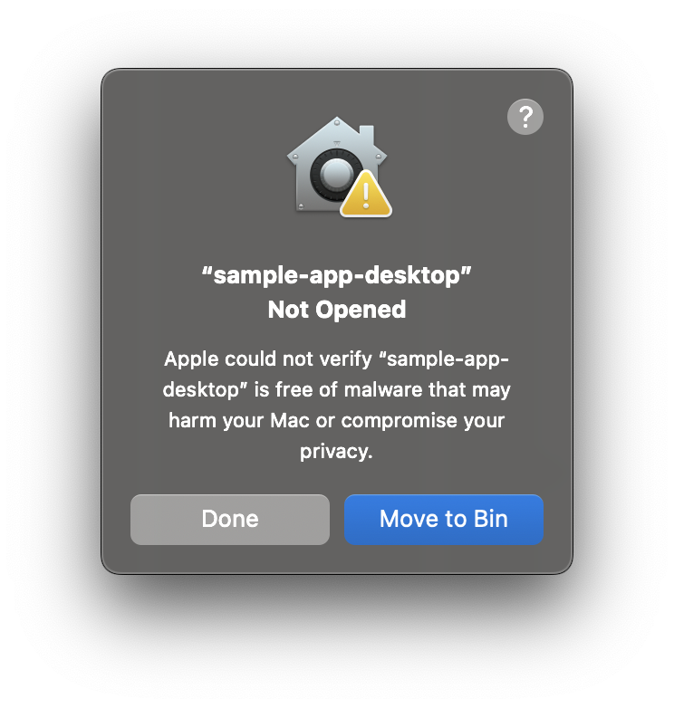
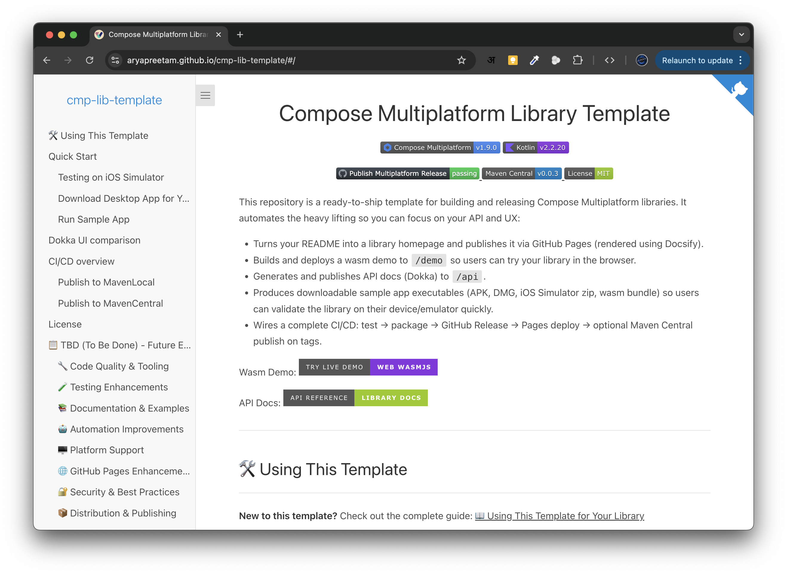
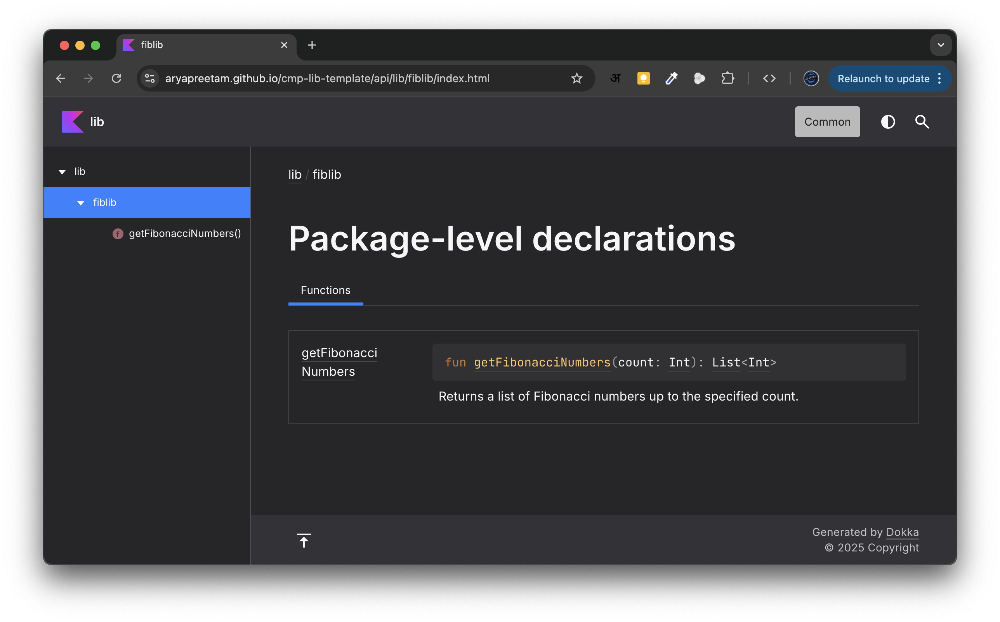
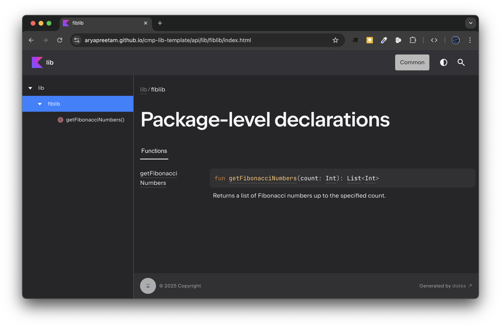
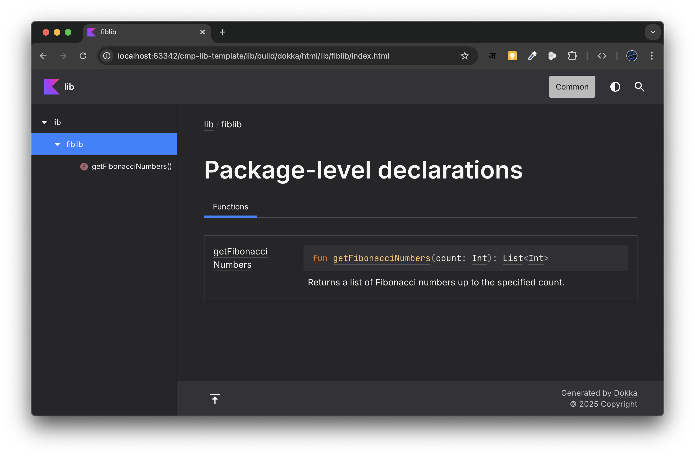
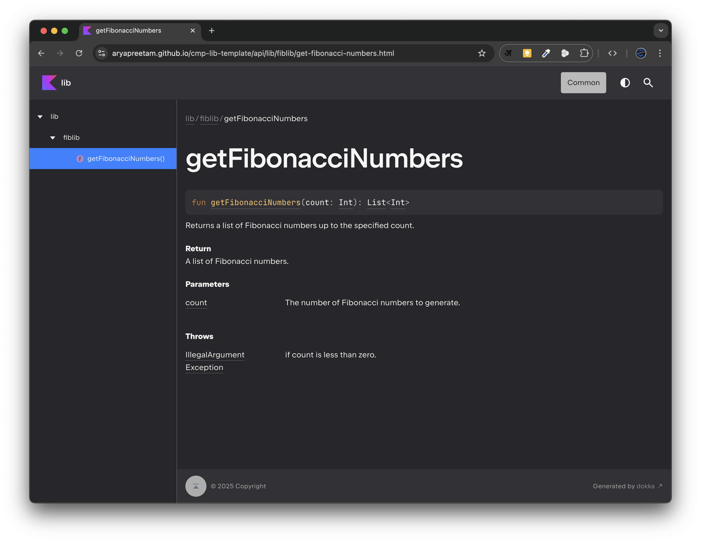
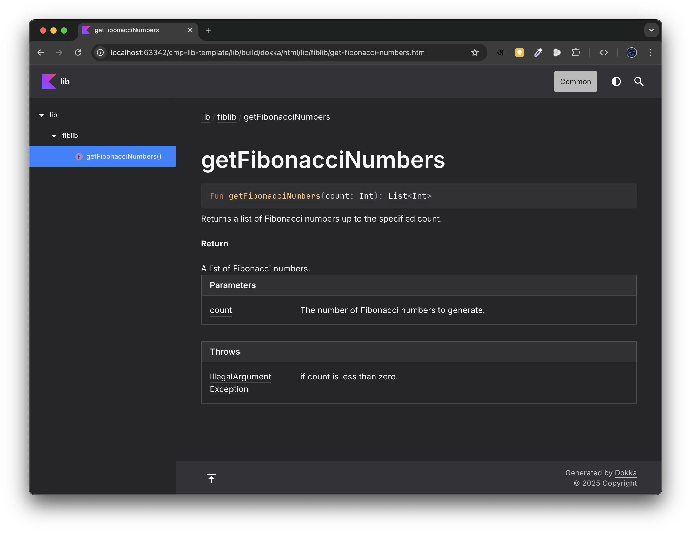
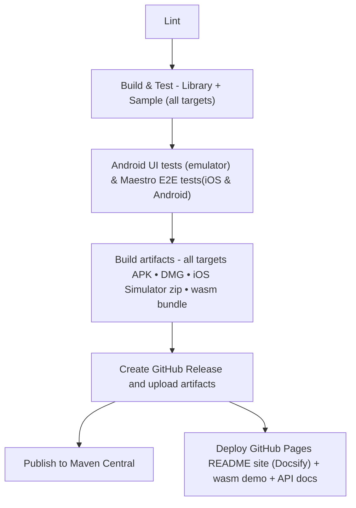

<h1 align="center">CMP WebView - Compose Multiplatform WebView Library</h1>

<p align="center">
  
  
</p>

<p align="center">
  <a href="https://github.com/aryapreetam/cmp-webview/actions/workflows/release.yml">
    
  </a>
  <a href="https://mvnrepository.com/artifact/io.github.aryapreetam/cmp-webview">
    
  </a>
  <a href="https://github.com/aryapreetam/cmp-webview/blob/main/LICENSE">
    
  </a>
</p>

<p align="center">
  
  
  
  
</p>

A comprehensive WebView library for Compose Multiplatform that enables you to display web content and HTML across
Android, iOS, Desktop (JVM), and Web (WASM) platforms with a unified API.

**Key Features:**

- 🌐 Load remote URLs (custom headers: Android only)
- 📄 Display HTML content directly
- 🔗 JavaScript → Compose messaging (via `onScriptResult`)
- 🔁 Compose → JavaScript calls (via `WebViewController.evaluateJavaScript`)
- 🔒 Built-in security protections against dangerous URL schemes
- ♿ Accessibility support with screen reader compatibility
- 🧪 Testing support with test tags and semantics
- 🎯 Single API across all platforms (some capabilities are platform-dependent)

## ✅ Platform capability matrix

| Capability | Android | iOS | Desktop (JVM) | Web (WASM) |
|---|---:|---:|---:|---:|
| Load remote `url` | ✅ | ✅ | ✅ | ✅ *(iframe; subject to CSP/X-Frame-Options)* |
| Load `htmlContent` | ✅ | ✅ | ✅ | ✅ |
| Custom request headers (`headers`) | ✅ | ❌ | ❌ | ❌ |
| JS → Compose (`onScriptResult`) with `htmlContent` | ✅ | ✅ | ✅ | ✅ |
| JS → Compose (`onScriptResult`) with remote `url` | ✅ *(bridge injected)* | ✅ *(bridge injected)* | ✅ *(bridge injected)* | ⚠️ *best-effort (no cross-origin injection)* |
| Compose → JS (`WebViewController.evaluateJavaScript`) | ✅ | ✅ | ✅ *(executes; no return values yet)* | ✅ *(same-origin / `htmlContent` only)* |
| `evaluateJavaScript` **return values** | ✅ | ✅ | ❌ *(returns `Unsupported`)* | ✅ *(same-origin / `htmlContent` only)* |

Notes:
- On **Web/WASM**, browsers prevent injecting scripts into **cross-origin** iframes. For reliable messaging on WASM, prefer `htmlContent` or same-origin pages you control.
- On native targets, bridge injection can still be affected by page security policies (e.g., strict CSP). Treat messaging as best-effort for arbitrary third-party pages.
- On **Desktop/JVM**, JavaScript execution is best-effort, but `evaluateJavaScript` currently does **not** surface return values (it returns `WebViewJsResult.Unsupported(...)`).

Wasm Demo:
[](https://aryapreetam.github.io/cmp-webview/demo/)

API Docs:
[](https://aryapreetam.github.io/cmp-webview/api/)

---

## 📦 Installation

Add the dependency to your Compose Multiplatform project:

**Option A — Version catalog (recommended)**

1) In `gradle/libs.versions.toml`:

```toml
[versions]
cmpWebview = "0.0.1"

[libraries]
cmp-webview = { module = "io.github.aryapreetam:cmp-webview", version.ref = "cmpWebview" }
```

2) In your module's `build.gradle.kts`:

```kotlin
kotlin {
  sourceSets {
    val commonMain by getting {
      dependencies {
        implementation(libs.cmp.webview)
      }
    }
  }
}
```

**Option B — Direct dependency**

```kotlin
kotlin {
  sourceSets {
    val commonMain by getting {
      dependencies {
        implementation("io.github.aryapreetam:cmp-webview:0.0.1")
      }
    }
  }
}
```

---

## 🚀 Quick Start

### Load a Remote URL

```kotlin
@Composable
fun MyScreen() {
  WebView(
    url = "https://example.com",
    modifier = Modifier.fillMaxSize(),
    onLoadStarted = { println("Loading started") },
    onLoadFinished = { println("Loading finished") },
    onLoadError = { error -> println("Error: $error") }
  )
}
```

### Display HTML Content

```kotlin
@Composable
fun HtmlScreen() {
  val html = """
        <html>
            <body>
                <h1>Hello from HTML!</h1>
                <p>This is rendered locally.</p>
            </body>
        </html>
    """.trimIndent()

  WebView(
    htmlContent = html,
    modifier = Modifier.fillMaxSize()
  )
}
```

### JavaScript Bridge Communication

JavaScript code in your web content can communicate with your Compose code:

**In your HTML/JavaScript:**

```javascript
// Listen for bridge ready event
window.addEventListener('ComposeWebViewBridgeReady', function () {
  // Send message to Compose
  ComposeWebViewBridge.postMessage('Hello from JavaScript!');
});

// Example: Send button click data
document.getElementById('myButton').addEventListener('click', function () {
  ComposeWebViewBridge.postMessage(JSON.stringify({
    action: 'buttonClick',
    data: 'some value'
  }));
});
```

**In your Compose code:**

```kotlin
@Composable
fun BridgeExample() {
  WebView(
    url = "https://example.com",
    onScriptResult = { message ->
      println("Received from JavaScript: $message")
      // Parse JSON if needed
      val data = Json.decodeFromString<MyData>(message)
      // Handle the message
    }
  )
}
```

### Compose → JavaScript (optional)

If you need to call JavaScript from Compose, pass a `WebViewController`.

```kotlin
@Composable
fun ComposeToJsExample() {
  val controller = rememberWebViewController()
  val scope = rememberCoroutineScope()

  Column {
    Button(onClick = {
      scope.launch {
        controller.evaluateJavaScript(
          "document.body.style.background = 'tomato';" +
            "window.ComposeWebViewBridge?.postMessage('ack');"
        )
      }
    }) {
      Text("Run JS")
    }

    WebView(
      htmlContent = "<html><body>...</body></html>",
      controller = controller,
      onScriptResult = { msg -> println("JS→Compose: $msg") },
    )
  }
}
```

Notes:
- On **Desktop/JVM**, the script runs best-effort, but return values are not available yet.
- On **Web/WASM**, calling JS only works reliably for `htmlContent` or same-origin content.

---

## 📖 Usage Guide

### Loading URLs with Custom Headers

**Note:** Custom headers are currently supported on **Android only**. Other targets will ignore headers or do not support attaching headers to a top-level navigation.

```kotlin
WebView(
  url = "https://api.example.com/data",
  headers = mapOf(
    "Authorization" to "Bearer YOUR_TOKEN",
    "User-Agent" to "MyApp/1.0"
  ),
  onLoadFinished = { println("Authenticated content loaded") }
)
```

### Loading HTML with Base URL

Use `baseUrl` to resolve relative links in your HTML:

```kotlin
val html = """
    <html>
        <body>
            
            <a href="page2.html">Next Page</a>
        </body>
    </html>
""".trimIndent()

WebView(
  htmlContent = html,
  baseUrl = "https://example.com/",  // Resolves to example.com/images/logo.png
)
```

### Error Handling

```kotlin
var errorMessage by remember { mutableStateOf<String?>(null) }

if (errorMessage != null) {
  Text("Error: $errorMessage")
  Button(onClick = { errorMessage = null }) {
    Text("Retry")
  }
} else {
  WebView(
    url = "https://example.com",
    onLoadError = { error ->
      errorMessage = error
    }
  )
}
```

---

## 🔒 Security Best Practices

### URL Validation

The library automatically rejects dangerous URL schemes:

- ❌ `javascript:` URLs (XSS risk)
- ❌ `vbscript:` URLs (XSS risk)
- ❌ `file:` URLs (local file access)
- ✅ `https:` URLs (recommended)
- ✅ `http:` URLs (use with caution)

**Best Practices:**

1. **Use HTTPS only in production** to prevent man-in-the-middle attacks
2. **Validate URLs from user input** before passing to WebView
3. **Use URL allowlists** for untrusted sources
4. **Sanitize HTML content** from untrusted sources to prevent XSS

```kotlin
// Example: URL validation
fun loadUserUrl(userInput: String) {
  val url = userInput.trim()

  // Validate scheme
  if (!url.startsWith("https://")) {
    showError("Only HTTPS URLs are allowed")
    return
  }

  // Validate against allowlist
  val allowedDomains = listOf("example.com", "trusted-site.com")
  if (!allowedDomains.any { url.contains(it) }) {
    showError("Domain not allowed")
    return
  }

  // Safe to load
  WebView(url = url)
}
```

### Bridge Message Security

Always validate and sanitize messages from JavaScript:

```kotlin
WebView(
  url = "https://example.com",
  onScriptResult = { message ->
    try {
      // Validate message format
      require(message.length < 10_000) { "Message too large" }

      // Parse and validate JSON
      val data = Json.decodeFromString<MyData>(message)
      require(data.userId.isNotBlank()) { "Invalid user ID" }

      // Process validated data
      handleValidatedData(data)
    } catch (e: Exception) {
      Log.w("WebView", "Invalid bridge message: ${e.message}")
    }
  }
)
```

### Content Security Policy (CSP)

For HTML content, include CSP headers to restrict resource loading:

```kotlin
val secureHtml = """
    <html>
        <head>
            <meta http-equiv="Content-Security-Policy" 
                  content="default-src 'self' https://trusted-cdn.com; script-src 'self'">
        </head>
        <body>...</body>
    </html>
""".trimIndent()

WebView(htmlContent = secureHtml)
```

---

## 🧪 Testing Guide

### Interop testing limitations (important)

`WebView` is an **interop** component on several targets:

- **Android**: `AndroidView` ✅ testable via Android **instrumented** Compose UI tests
- **iOS**: `UIKitView` ⚠️ `runComposeUiTest` currently fails for interop views (`LocalInteropContainer not provided`)
- **Web/WASM**: `WebElementView` ⚠️ `runComposeUiTest` currently fails for interop views (`LocalInteropContainer not provided`)
- **Desktop/JVM**: `SwingPanel` ⚠️ `runComposeUiTest` does not provide `LocalInteropContainer` for `SwingPanel`

Practical strategy:

- Prefer **Android instrumented tests** for true end-to-end WebView behavior.
- On **Desktop/JVM**, use a Swing/ComposeWindow/ComposePanel-based integration harness (see the sample test at `sample/composeApp/src/jvmTest/.../WebViewBridgeIntegrationJvmTest.kt`).
- For **iOS/WASM**, rely on manual QA for the interop surface + common/unit tests for shared bridge logic.

### UI Testing with Test Tags

Use the `testTag` parameter to identify WebViews in tests:

> Note: The snippet below assumes an Android-style Compose UI test rule. For Desktop interop views, use a
> ComposePanel/ComposeWindow-based harness; for iOS/WASM, avoid `runComposeUiTest` for interop.

```kotlin
// In your composable
@Composable
fun MyScreen() {
  WebView(
    url = "https://example.com",
    testTag = "main-webview"
  )
}

// In your test
@Test
fun testWebViewLoads() {
  composeTestRule.setContent {
    MyScreen()
  }

  // Find WebView by test tag
  composeTestRule
    .onNodeWithTag("main-webview")
    .assertExists()
}
```

### Testing Loading States with Semantics

The WebView exposes loading state through semantics:

```kotlin
@Test
fun testLoadingState() {
  composeTestRule.setContent {
    WebView(
      url = "https://example.com",
      testTag = "test-webview"
    )
  }

  // Verify loading state is announced
  composeTestRule
    .onNodeWithTag("test-webview")
    .assertExists()
    .assert(hasStateDescription("Loading"))

  // Wait for loaded state
  composeTestRule.waitUntil(timeoutMillis = 5000) {
    composeTestRule
      .onNodeWithTag("test-webview")
      .fetchSemanticsNode()
      .config[SemanticsProperties.StateDescription] == "Loaded"
  }
}
```

### Testing Bridge Communication

```kotlin
@Test
fun testBridgeMessage() {
  var receivedMessage: String? = null

  composeTestRule.setContent {
    WebView(
      htmlContent = """
                <html><body><script>
                    window.addEventListener('ComposeWebViewBridgeReady', function() {
                        ComposeWebViewBridge.postMessage('test-message');
                    });
                </script></body></html>
            """.trimIndent(),
      onScriptResult = { message ->
        receivedMessage = message
      }
    )
  }

  // Wait for bridge message
  composeTestRule.waitUntil(timeoutMillis = 3000) {
    receivedMessage == "test-message"
  }

  assertEquals("test-message", receivedMessage)
}
```

---

## ♿ Accessibility

The WebView library provides built-in accessibility support for screen readers like TalkBack (Android) and VoiceOver (
iOS).

### Automatic Semantics

Every WebView automatically provides:

- **Content Description:** "Web content display"
- **State Description:** Current loading state ("Idle", "Loading", "Loaded", "Error")

### Screen Reader Announcements

```kotlin
WebView(
  url = "https://example.com",
  onLoadStarted = {
    // Screen reader announces: "Web content display, Loading"
  },
  onLoadFinished = {
    // Screen reader announces: "Web content display, Loaded"
  },
  onLoadError = { error ->
    // Screen reader announces: "Web content display, Error"
  }
)
```

### Best Practices

1. **Provide meaningful test tags** for navigation:
   ```kotlin
   WebView(url = "...", testTag = "article-webview")
   ```

2. **Use descriptive error messages** for screen readers:
   ```kotlin
   WebView(
       url = "...",
       onLoadError = { error ->
           announceForAccessibility("Failed to load page: $error")
       }
   )
   ```

---

## 🔧 Platform-Specific Notes

### Android

- Uses native Android WebView
- JavaScript is enabled by default
- Supports all standard web features

### iOS

- Uses WKWebView
- Supports modern web standards
- Bridge communication via WKScriptMessageHandler

### Desktop (JVM)

- Uses KCEF/JCEF (Chromium Embedded Framework)
- **Known limitation:** `evaluateJavaScript` executes best-effort but does **not** return values yet (returns `WebViewJsResult.Unsupported(...)`).

### Web (WASM)

- Uses HTML iframe
- **Cross-origin limitations:** Bridge only works for same-origin content
- For cross-origin URLs, the iframe cannot inject bridge scripts due to browser security

---

## 🐛 Troubleshooting

### Bridge Not Receiving Messages

**Problem:** JavaScript bridge messages aren't reaching Compose code.

**Solutions:**

1. **Wait for bridge ready:**
   ```javascript
   window.addEventListener('ComposeWebViewBridgeReady', function() {
       // Now safe to send messages
       ComposeWebViewBridge.postMessage('hello');
   });
   ```

2. **Check platform compatibility:**
    - Desktop: Ensure using `javaBridge`
    - Web/WASM: Only works for same-origin content

3. **Verify callback is set:**
   ```kotlin
   WebView(
       url = "...",
       onScriptResult = { message ->  // Must provide this callback
           println("Received: $message")
       }
   )
   ```

### Load Errors

**Problem:** WebView fails to load URL or shows error.

**Solutions:**

1. **Check internet connectivity**
2. **Verify URL is valid and accessible:**
   ```kotlin
   WebView(
       url = "https://example.com",  // Must be valid HTTPS/HTTP
       onLoadError = { error ->
           Log.e("WebView", "Load failed: $error")
       }
   )
   ```

3. **Check for blocked schemes:**
    - `javascript:`, `vbscript:`, `file:` are blocked for security

4. **Verify SSL certificate** (HTTPS only):
    - Self-signed certificates may be rejected on some platforms

### Content Not Displaying

**Problem:** WebView appears blank or doesn't show content.

**Solutions:**

1. **Check modifier size:**
   ```kotlin
   WebView(
       url = "...",
       modifier = Modifier.fillMaxSize()  // Or specific size
   )
   ```

2. **Verify content loaded:**
   ```kotlin
   WebView(
       url = "...",
       onLoadFinished = { 
           println("Content loaded successfully")
       }
   )
   ```

3. **Check HTML validity** (for HTML content):
   ```kotlin
   val html = "<html><body>Content</body></html>"  // Must be valid HTML
   WebView(htmlContent = html)
   ```

### Memory Leaks

**Problem:** App memory grows over time with WebViews.

**Solutions:**

1. **WebView automatically cleans up** when disposed via DisposableEffect
2. **Avoid keeping strong references** to WebView callbacks
3. **Test with memory profiler** to verify cleanup

### Desktop WebView Limitation

**Problem:** Desktop WebView can only be created once per application session.

**Solutions:**

1. **Reuse the same WebView instance** - change URL instead of recreating
2. **Use conditional composition:**
   ```kotlin
   var currentUrl by remember { mutableStateOf("https://example.com") }
   
   // Reuse same WebView, just change URL
   WebView(url = currentUrl)
   
   // Change URL instead of recreating
   Button(onClick = { currentUrl = "https://other-site.com" }) {
       Text("Load Other Site")
   }
   ```

See `specs/001-add-url-loading/desktop-webview-limitation.md` for detailed explanation.

---

## 📊 Performance Considerations

### Memory Management

- WebView instances are **automatically cleaned up** when removed from composition
- Each platform implements proper disposal (removing bridge interfaces, clearing history, etc.)
- Callbacks are **not invoked after disposal** to prevent memory leaks

### Caching Behavior

- **Android:** Uses system WebView cache (configurable via WebSettings)
- **iOS:** Uses WKWebView cache (automatic)
- **Desktop:** Uses JavaFX WebView cache
- **Web:** Uses browser's iframe cache

### Best Practices

1. **Limit concurrent WebViews** - each instance consumes memory
2. **Dispose when not needed** - remove from composition to trigger cleanup
3. **Avoid large HTML content** - split into smaller chunks if possible
4. **Use appropriate loading indicators** - improve perceived performance

---

## 📦 Download Sample App Executables

Download and try the sample app on your platform without building from source:

| Platform                     | Download Link                                                                                                                                                                                                     |
|------------------------------|-------------------------------------------------------------------------------------------------------------------------------------------------------------------------------------------------------------------|
| 🍏 **macOS (Intel)**         | [](https://github.com/aryapreetam/cmp-webview/releases/latest/download/sample-app-desktop-x64.dmg)                      |
| 🍎 **macOS (Apple Silicon)** | [](https://github.com/aryapreetam/cmp-webview/releases/latest/download/sample-app-desktop-arm64.dmg)                  |
| 🪟 **Windows**               | [](https://github.com/aryapreetam/cmp-webview/releases/latest/download/sample-app-windows.msi)            |
| 🤖 **Android**               | [](https://github.com/aryapreetam/cmp-webview/releases/latest/download/sample-app-android-unsigned.apk)    |
| 🌐 **Web (Wasm)**            | [](https://github.com/aryapreetam/cmp-webview/releases/latest/download/sample-app-wasm.zip)                          |
|  **iOS Simulator**          | [](https://github.com/aryapreetam/cmp-webview/releases/latest/download/sample-app-ios-simulator.zip) |

### How to Run the Sample App

#### 🤖 Android

**Option 1: Drag and Drop**

- Download the APK file
- Open an Android emulator or connect a physical device
- Drag the APK onto the emulator window

**Option 2: ADB Install**

```bash
adb install sample-app-android-unsigned.apk
```

#### 🌐 Web (Wasm)

- Download and unzip `sample-app-wasm.zip`
- Open `index.html` in a web browser

**Note:** You can also try the live demo without
downloading: [Try Live Demo](https://aryapreetam.github.io/cmp-webview/demo/)

#### 🍏 iOS Simulator

- Download `sample-app-ios-simulator.zip` from the [latest release](https://github.com/aryapreetam/cmp-webview/releases)
- Unzip to get `sample-app-ios-simulator.app`
- Open your iOS Simulator in Xcode
- Drag the `.app` onto the Simulator window OR run:
  ```sh
  xcrun simctl install booted /path/to/sample-app-ios-simulator.app
  ```
- The sample app will now appear and can be launched directly from the Simulator!

#### 🍎 macOS

- Download the DMG for your Mac architecture (Intel or Apple Silicon)
- Open (mount) the DMG and drag the app to your Applications folder (or Desktop)
- **When you try to open the app for the first time, you may see a Gatekeeper warning:**

  <p align="center">
    
    <br/>
    <sub>Mac Gatekeeper dialog when opening the app for the first time</sub>
  </p>

- To allow running the app:
    1. **Right-click (control-click) the app and select "Open".**
    2. In the dialog, click "Open". (If there is a question mark in the corner, you can click it for more info.)
    3. The app will start. This is safe for open-source/test builds.

> This is a normal security step for all open-source and CI-generated Mac executables. Apps are signed ad-hoc for
> internal/dev use, not with a public Apple developer ID.

**Tip:** Unsure about your Mac's type? Click the Apple logo → "About This Mac". If it says Intel, download x64; if it
says M1, M2, or M3, download arm64.

#### 🪟 Windows

- Download and run the MSI installer
- Follow the installation wizard
- Launch the app from the Start menu

---

## 🚀 What This Template Provides

This template automatically generates and deploys three key resources for your library:

| Resource                 | Description                                                      | Preview                                                                             |
|--------------------------|------------------------------------------------------------------|-------------------------------------------------------------------------------------|
| 📚 **Library Homepage**  | Your README becomes a beautiful landing page with Docsify        |  |
| 📖 **API Documentation** | Automatically generated Dokka docs with improved UI (2.1.0-Beta) |           |
| 🌐 **Live Wasm Demo**    | Interactive browser demo of your sample app                      |                |

All three are automatically deployed to GitHub Pages:

- **Homepage:** `https://<username>.github.io/<library-name>/`
- **API Docs:** `https://<username>.github.io/<library-name>/api/`
- **Demo:** `https://<username>.github.io/<library-name>/demo/`

---

## 🛠️ Run Sample App from Source

You can also run Gradle tasks in the terminal:

* `./gradlew run` to run application
* `./gradlew package` to store native distribution into `build/compose/binaries`

### Run Sample App by Platform

- **Desktop JVM (recommended):** `./gradlew :sample:composeApp:jvmRun -DmainClass=MainKt`

  **Note:** On Desktop, `:sample:composeApp:run` can get stuck at `CefApp INITIALIZING` depending on the Gradle JVM / JBR / JCEF wiring (especially when running via composite builds or different IDE run configs). If that happens, prefer `jvmRun` and ensure Gradle uses JetBrains Runtime (JBR) with JCEF.
- **Android:** Open project in Android Studio and run the sample app
- **iOS:** Open `sample/iosApp/iosApp.xcodeproj` in Xcode and run the sample app
- **Wasm:** `./gradlew :sample:composeApp:wasmJsBrowserRun`

---

## Dokka UI comparison

The API documentation appearance has improved with Dokka 2.1.0-Beta. Below is a quick visual comparison.

| Dokka (2.0.0)                                           | Dokka (2.1.0-Beta)                                      |
|---------------------------------------------------------|---------------------------------------------------------|
|    |    |
|  |  |

## CI/CD overview

This repo ships with an opinionated CI/CD that builds, tests, packages, releases, and deploys docs & demo automatically
on tags.



Key points:

- Triggered on version tags (`v*`) and manual runs.
- Lint first, then build/test library targets followed by sample targets.
- Android UI tests on emulator before packaging.
- GitHub Release includes platform artifacts for quick validation.
- GitHub Pages hosts the README homepage (Docsify), wasm demo, and Dokka API docs.

---

### Publish to MavenLocal

1) Run `./gradlew :lib:publishToMavenLocal`
2) Open `~/.m2/repository/cmp-webview/`

### Publish to MavenCentral

Follow https://www.jetbrains.com/help/kotlin-multiplatform-dev/multiplatform-publish-libraries.html & complete all
necessary steps.

The above article focuses on publishing to MavenCentral.
But if you want to verify publishing from your local machine, you can follow below steps:

1) Add these lines to `~/.gradle/gradle.properties`(not to be confused with `gradle.properties` in project root):
   ```
   signing.keyId=XXXXXXXX
   signing.password=[key password]
   signing.secretKeyRingFile=../XXXXXXXX.gpg
   mavenCentralUsername=[generated username]
   mavenCentralPassword=[generated password]
   ```
   For `GPG_KEY_CONTENTS` secret(signing.secretKeyRingFile above), can get plain text version of gpg key using below
   commands.
   ```
   # This will print the private GPG key in plain text.
   gpg --export-secret-keys --armor <key id>
   
   # this will copy it for pasting in github actions secrets.
   gpg --export-secret-keys --armor <key id> | pbcopy
   ```
5) Run `./gradlew :lib:publishAndReleaseToMavenCentral --no-configuration-cache`

## License

MIT License © 2025 aryapreetam and contributors. See [LICENSE](./LICENSE) for details.

---

## 🙏 Acknowledgments

This template was built with inspiration and learnings from the excellent work of the Kotlin multiplatform community:

- **Project Setup:** Initial project structure was created
  using [Kotlin Multiplatform Web Wizard](https://terrakok.github.io/kmp-web-wizard/)
  by [terrakok](https://github.com/terrakok)

- **Inspirations:**
    - [Reorderable](https://github.com/Calvin-LL/Reorderable) by Calvin-LL - For a library that seamlessly works across
      all platforms, and most importantly, providing demo app APK in releases to test before integrating
    - [compose-multiplatform-library-template](https://github.com/KevinnZou/compose-multiplatform-library-template) by
      KevinnZou
    - [compose-multiplatform-library-template](https://github.com/meticha/compose-multiplatform-library-template) by
      meticha

Special thanks to:

- **GitHub** for hosting this project and providing free compute resources for CI/CD through GitHub Actions
- **JetBrains** for building the incredible Kotlin Multiplatform and Compose Multiplatform frameworks that enable us to
  build truly cross-platform applications with shared code
- The entire **Kotlin Multiplatform and Compose Multiplatform communities** for making cross-platform development better
  every day!

---

## 📋 TBD (To Be Done) - Future Enhancements

This section lists planned improvements and features for the template. Contributions are welcome!

### 🔧 Code Quality & Tooling

- [ ] **Add Detekt** - Static code analysis for Kotlin
    - Configure rules for library code
    - Integrate into CI pipeline

- [ ] **Add ktlint** - Kotlin code formatter
    - Consistent code style across project
    - Auto-formatting in CI

- [ ] **Add Kover** - Code coverage reporting
    - Track test coverage across platforms
    - Publish coverage reports to Codecov

- [ ] **Add Dependabot** - Automated dependency updates
    - Weekly checks for Gradle dependencies
    - Weekly checks for GitHub Actions versions

### 🧪 Testing Enhancements

- [ ] **Screenshot Testing** - Visual regression testing
    - Add Paparazzi for Android
    - iOS screenshot tests using XCTest

- [ ] **Performance Benchmarking** - Track performance metrics
    - Integrate androidx.benchmark for Android
    - Baseline profiles for library code

### 📚 Documentation & Examples

- [ ] **Multi-Module Support Guide**
    - Document how to structure multi-module libraries
    - Example with feature modules

- [ ] **Compose Resources Guide**
    - How to bundle images, strings, fonts
    - Localization examples
    - Resource packaging best practices

- [ ] **Video Tutorial**
    - 10-minute walkthrough of using the template
    - Publishing to Maven Central demo
    - Deploying demo and docs

- [ ] **Blog Post / Article**
    - Write comprehensive guide on Dev.to or Medium
    - Share on Reddit r/Kotlin and r/Kotlinmobile

### 🤖 Automation Improvements

- [ ] **Automated Changelog Generation**
    - Use conventional commits
    - Auto-generate release notes from commits/PRs
    - Integrate github-changelog-generator

- [ ] **Version Bump Automation**
    - Script to update version in lib/build.gradle.kts
    - Semantic versioning support
    - Consider semantic-release integration

- [ ] **Automated Screenshots**
    - Generate sample app screenshots during CI
    - Attach to releases or README

### 🖥️ Platform Support

- [ ] **Linux Desktop Packaging**
    - Add DEB/RPM package generation
    - AppImage support

- [ ] **Additional Apple Platforms**
    - watchOS support
    - tvOS support
    - macCatalyst support

- [ ] **Desktop Linux Native Build**
    - Build on Linux runners for native Linux apps
    - Better Linux desktop integration

### 🌐 GitHub Pages Enhancements

- [ ] **Custom Domain Support**
    - Document setup for custom domains
    - DNS configuration guide

- [ ] **Improved Docsify Theme**
    - Custom theme matching library branding
    - Dark mode support
    - Better mobile responsive design

- [ ] **Search Functionality**
    - Add search to documentation site
    - Full-text search across API docs

### 🔐 Security & Best Practices

- [ ] **Vulnerability Scanning**
    - Integrate Snyk or similar
    - Automated security updates

- [ ] **SBOM Generation**
    - Generate Software Bill of Materials
    - Dependency transparency

- [ ] **Signed Releases**
    - Sign release artifacts with GPG
    - Provide checksums (SHA256)

### 📦 Distribution & Publishing

- [ ] **JitPack Support**
    - Alternative to Maven Central
    - Easier for snapshot builds

- [ ] **NPM Package for Wasm**
    - Publish wasm builds to NPM
    - Better integration with web projects

- [ ] **CocoaPods Support**
    - Publish iOS framework to CocoaPods
    - Easier iOS integration

### 🎨 Template Features

- [ ] **Template Initialization Script**
    - Interactive CLI to customize template
    - Automated find/replace for package names
    - Git history cleanup

---

### 💡 Have an Idea?

If you have suggestions for improvements or want to contribute:

1. Check if the feature is already listed above
2. Open an issue to discuss your idea
3. Submit a PR with your implementation

**Priority**: Items marked with 🔥 are high priority and would have the most impact.

---

## 🤝 Contributing

See [CONTRIBUTING.md](CONTRIBUTING.md) for detailed contribution guidelines.
